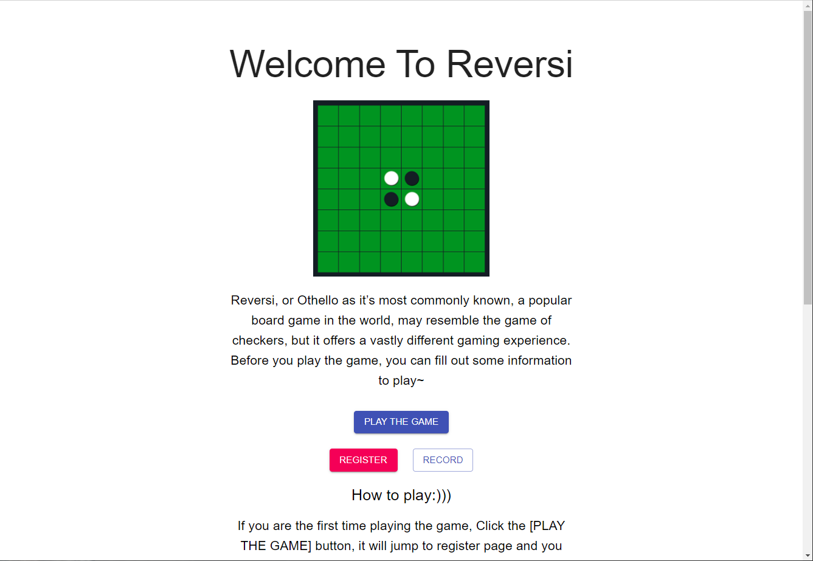
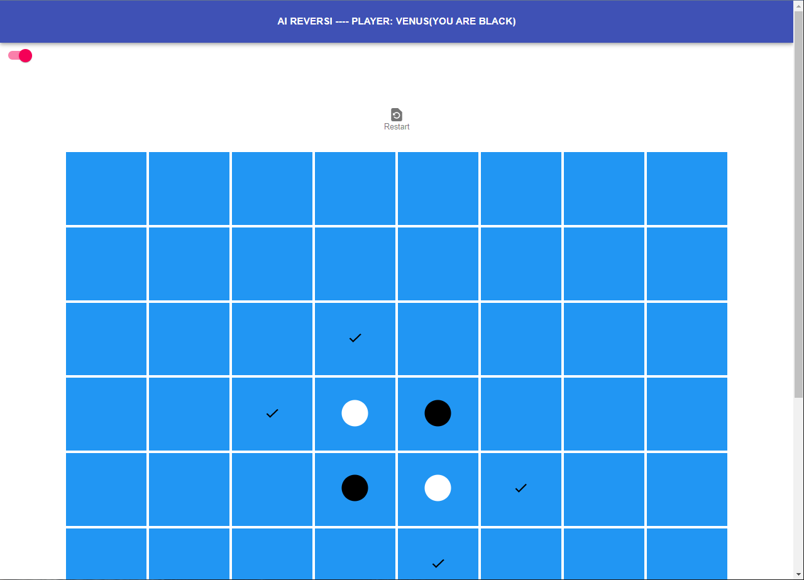

## Project Introduction

#### Goal and Overview

This is a simple game called Reversi for users. Before playing Reversi, the user needs to register with their name, and then their record list will show their information. There is an introduction on the landing page and on the bottom of the page, the user can click the link to see how to play the reversi.

#### Programming languages

***Typescript:***
Implement the frontend of the game with the UI for user to play the reversi.

- **Library:**
   React + formik + material UI + yup

***Python***:
Implement the backend of the game, and also as the Remote Procedure Call(RPC) client sending a request to RPC server, and use a sqlite database to store the user information data.

 - **Library:**
   flask, flask-sqlalchemy,marshmallow-sqlalchemy

***Go***:
As an RPC server, it replies to the result to the RPC client. Cooperate with python and responsible for some calculations and improve the performance in the project.
 - **Library:**
   amqp

#### Inter-language communication methods

**REST API**: is used to communicate with Typescript and Python between frontend and backend.

**RabbitMQ**: is used to communicate between Python and Go using RPC mode.

##### Deployment technology:
Docker containers


#### Steps for using the project

1. Please `cd ` in the terminal to the folder with ```docker-compose.yml``` where you download the project, and make sure ```http://localhost:5000/```
and ```http://localhost:3000/``` is available.
**Run** 
   ```docker-compose build```
   ```docker-compose up``` 
and you probably will wait a few minutes(on my computer it is 4 mins), please be patient. If you see the `go_1 | Awaiting RPC requests`, it is build successfully, otherwise, please quit the docker *(ctrl+c or command+c)* when you see ```Failed to connect to RabbitMQ: dial tcp 172.19.0.2:5672: connect: connection refused```.
After **rerun** ```docker-compose up``` you see the `go_1 | Awaiting RPC requests` in the terminal.

1. Open Chrome browser or Microsoft edge browser and type 
   ```http://localhost:3000/```
   , you will see the game land page on running

1. You will see a simply game introduction and there are three buttons on the center, below that, there is a guide of how to play, please read it!
Besides, there is a website link to a rule after the introduction, you can briefly know how to play.
#### Feature
- Using React + Material UI to make a good design of the reversi game to interact with user  
- Using Alpha–beta pruning to make a opponent of the reversi game to fight with user  
- Store the data using sqlite and they rank different username's user average score in descent order on the record page
- Quick Calculation using Go system language
- High performance Inter-languages communications using rabbitmq and RESTAPI
- Change the theme when you play the game

#### Demo
Run successful:

Demo Game:


#### Package
frontend:
npm install react
npm install history
npm install @material-ui/lab
npm install formik-material-ui
npm install formik
npm install react-cookies --save
backend: 
pip3 install -U flask-sqlalchemy marshmallow-sqlalchemy
pip3 install flask flask_sqlalchemy
pip3 install flask-marshmallow
pip3 install pika
pip3 install -U flask-cors

#### Reference
Reversi Image and simple Introduction from:
https://www.gamblingsites.com/skill-games/reversi/
Reversi: https://github.com/snerks/react-mui-reversi-ts